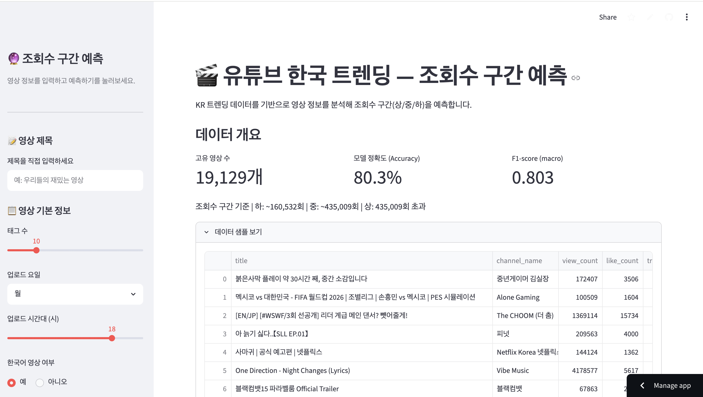
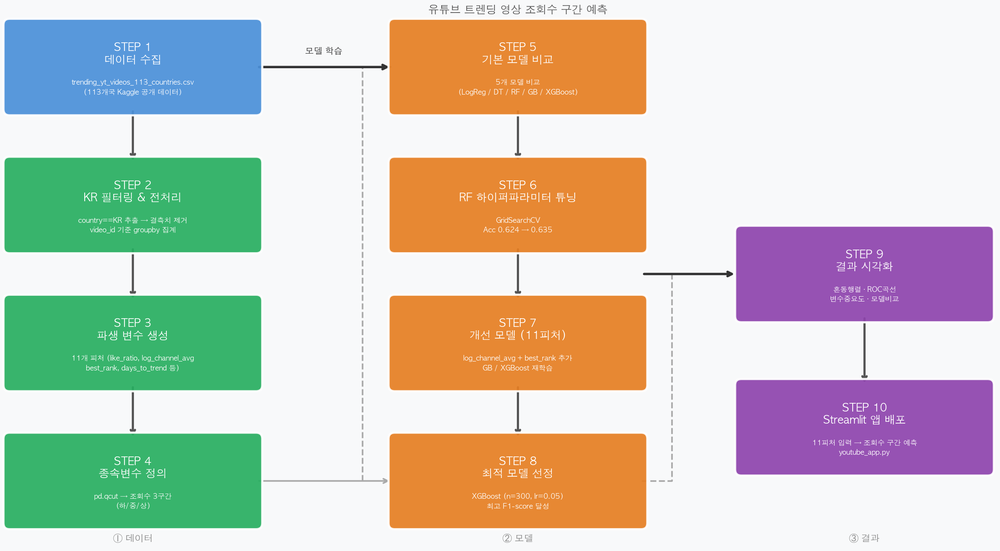
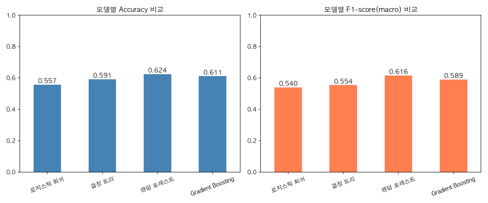
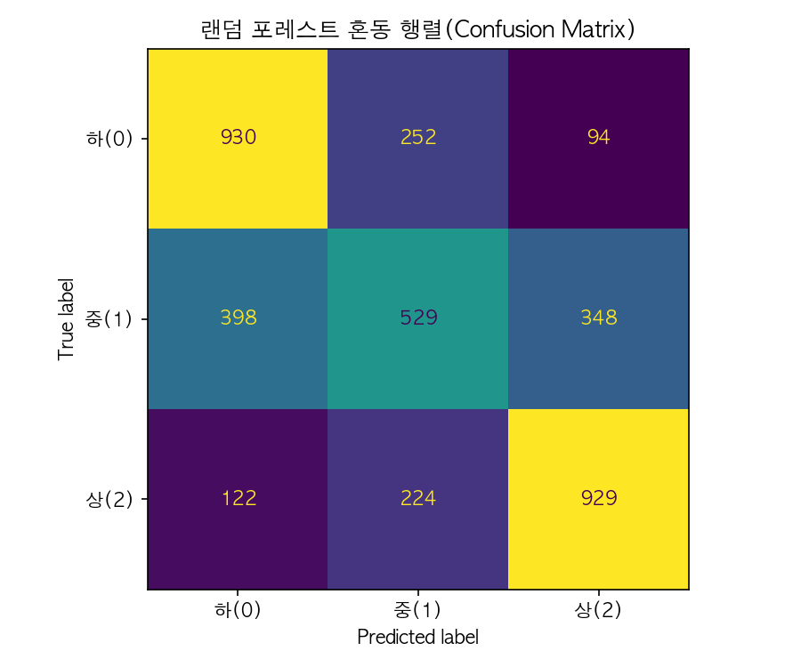
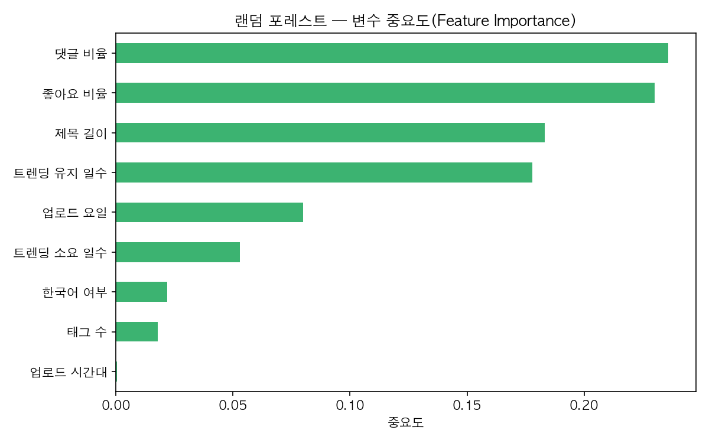
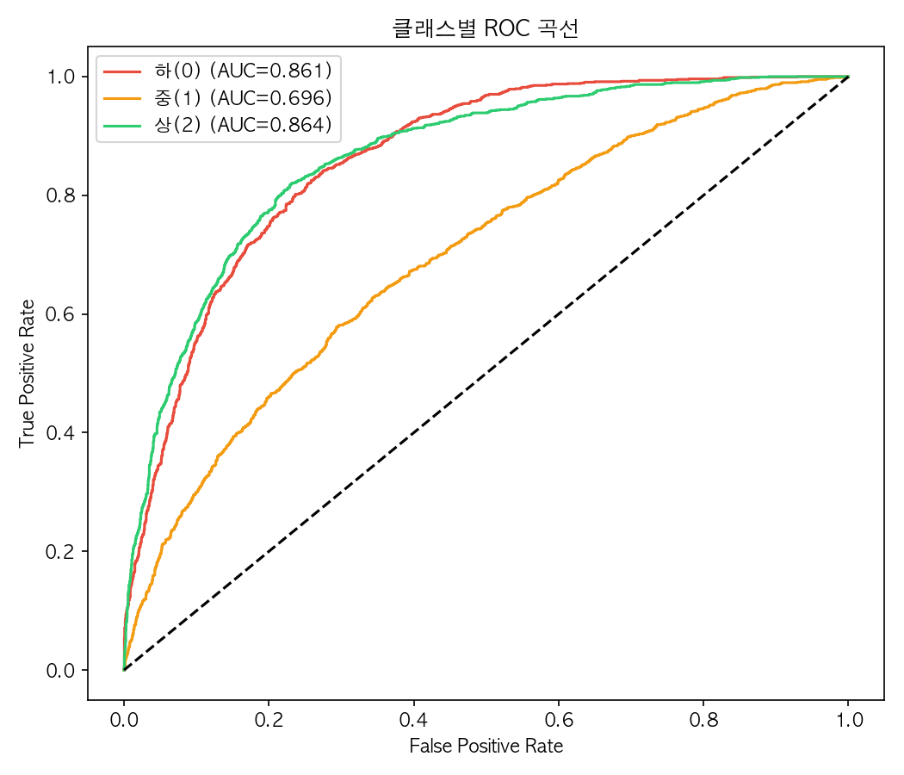
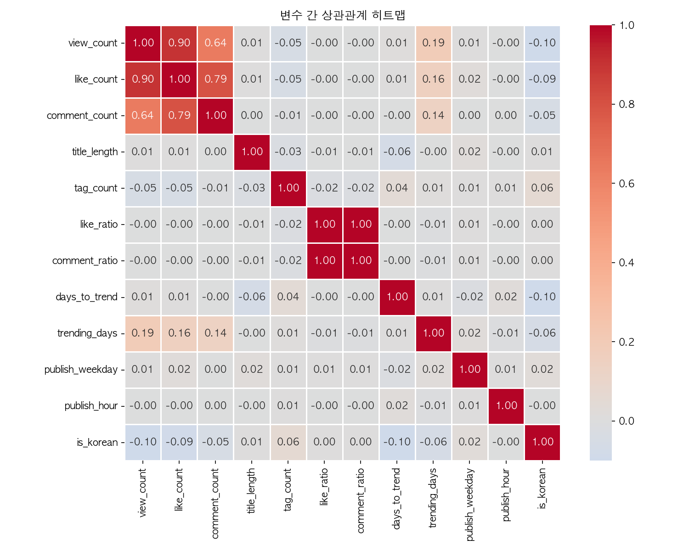

# 🎬 유튜브 한국 트렌딩 — 조회수 구간 예측

<p align="center">
  
  
  
  
</p>

<p align="center">
  Kaggle 글로벌 유튜브 트렌딩 데이터(113개국)에서 <strong>한국(KR) 데이터</strong>를 필터링하여<br>
  영상 메타데이터만으로 <strong>조회수 구간(상·중·하)을 예측</strong>하는 머신러닝 프로젝트입니다.
</p>

---

## 📸 앱 데모

<p align="center">
  
</p>

> Streamlit 기반 웹앱 — 영상 정보 입력 후 조회수 구간(상·중·하)을 실시간 예측합니다.

---

## 💡 프로젝트 배경

유튜브 알고리즘에서 **트렌딩 진입**은 창작자에게 핵심 지표이지만, 어떤 요소가 실제로 조회수를 결정하는지는 불투명합니다.

이 프로젝트는 **한국 트렌딩 영상 데이터**를 분석해:
- 조회수에 영향을 주는 핵심 피처를 데이터로 검증하고
- 영상 메타데이터만으로 조회수 구간을 분류하는 ML 모델을 구축하는 것을 목표로 합니다.

---

## 📁 프로젝트 구조

```
ML_youtubeTrend/
├── 📓 notebooks/
│   └── youtube_trending_kr_analysis.ipynb   # 전체 분석 노트북 (STEP 1~14)
├── 📊 reports/figures/                       # 분석 결과 시각화 10종
├── 🤖 ml/                                    # 전처리·학습·평가 모듈
├── 🌐 youtube_app.py                         # Streamlit 예측 웹앱
├── requirements.txt
└── .gitignore
```

---

## 📦 사용 데이터

| 항목 | 내용 |
|---|---|
| 출처 | Kaggle — Global YouTube Trending Video Statistics |
| 전체 규모 | 113개국, 약 50만 행 |
| 분석 대상 | `country == 'KR'` 필터링 후 **약 19,000개** 고유 영상 |

> ⚠️ CSV 파일은 용량 문제로 `.gitignore`에 포함되어 있습니다. Kaggle에서 직접 다운로드 후 루트 디렉토리에 위치시켜 주세요.

---

## 🔄 분석 프로세스

<p align="center">
  
</p>

---

## 🧮 사용 피처 (11개)

| 피처 | 설명 |
|---|---|
| `title_length` | 제목 글자 수 |
| `tag_count` | 태그 개수 |
| `like_ratio` | 좋아요 / 조회수 비율 |
| `comment_ratio` | 댓글 / 조회수 비율 |
| `days_to_trend` | 업로드 후 트렌딩까지 소요 일수 |
| `trending_days` | 트렌딩 유지 일수 |
| `publish_weekday` | 업로드 요일 (0=월 ~ 6=일) |
| `publish_hour` | 업로드 시간대 |
| `is_korean` | 한국어 영상 여부 (1/0) |
| `best_rank` | 트렌딩 기간 중 최고 순위 |
| `log_channel_avg` | 채널 평균 조회수 (로그 변환) |

---

## 📈 모델 성능 비교

| 모델 | Accuracy | F1-score |
|---|---|---|
| 로지스틱 회귀 | 0.557 | 0.540 |
| 결정 트리 | 0.592 | 0.554 |
| 랜덤 포레스트 | 0.624 | 0.616 |
| GradientBoosting | 0.611 | 0.589 |
| 랜덤 포레스트 (튜닝) | 0.636 | 0.626 |
| **GradientBoosting (11피처, 최종)** | **0.803** | **0.803** |

<p align="center">
  
</p>

---

## 🖼️ 분석 결과 시각화

<table>
  <tr>
    <td align="center">
      <br/>
      혼동 행렬
    </td>
    <td align="center">
      <br/>
      특성 중요도
    </td>
  </tr>
  <tr>
    <td align="center">
      <br/>
      ROC 곡선
    </td>
    <td align="center">
      <br/>
      상관관계 히트맵
    </td>
  </tr>
</table>

---

## 🎯 종속변수 정의

`pd.qcut`으로 조회수를 3분위 분할:

| 구간 | 기준 조회수 |
|---|---|
| 🔵 하 | ~160,532회 (하위 33%) |
| 🟡 중 | ~435,009회 (중위 33~66%) |
| 🔴 상 | 435,009회 초과 (상위 33%) |

---

## 🚀 실행 방법

```bash
# 1. 의존성 설치
pip install -r requirements.txt

# 2. Streamlit 앱 실행
streamlit run youtube_app.py

# 3. ngrok으로 외부 공유 (선택)
ngrok http 8501
```

---

## 📌 향후 개선 사항

- [ ] XGBoost / LightGBM 추가 실험
- [ ] 피처 엔지니어링 고도화 (썸네일 이미지 분석 등)
- [ ] 실시간 YouTube Data API 연동
- [ ] 다국가 데이터로 범위 확장
